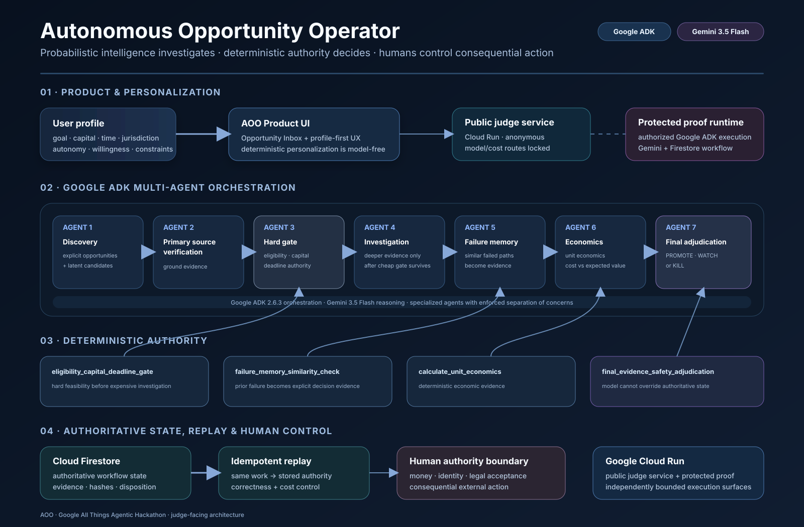

# Autonomous Opportunity Operator (AOO)

> AI should not just generate ideas. It should determine which opportunities are real, feasible, and worth pursuing — and stop bad paths early.

Autonomous Opportunity Operator is a Google ADK multi-agent system that discovers and synthesizes opportunities, verifies primary evidence, applies deterministic feasibility and economics gates, remembers failed paths, and produces an evidence-backed final decision.

Built for the Google All Things Agentic Hackathon.

## Live judge demo

Public demo:

https://aoo-judge-demo-5zuibmpnwa-uc.a.run.app

Technical proof console:

https://aoo-judge-demo-5zuibmpnwa-uc.a.run.app/judge-console

The public deployment intentionally runs in judge-safe mode:

- product exploration is public
- deterministic personalization is public
- provenance is public
- the technical proof console is public
- anonymous discovery mutations are disabled
- anonymous Google ADK / Gemini execution is disabled
- consequential external actions remain human-controlled

The contest demo video shows the genuine live seven-agent workflow on the protected proof runtime.

## The problem

The difficult problem is not generating more ideas.

The difficult problem is deciding:

- Is this opportunity real?
- Is the primary evidence trustworthy?
- Can this specific person actually pursue it?
- Does it fit their capital, time, jurisdiction and autonomy constraints?
- Is the expected economic value good enough?
- Has a similar path already failed?
- Is deeper AI investigation worth paying for?
- Should the system pursue, watch or kill the path?

AOO turns that decision process into an autonomous, evidence-backed workflow.

## What AOO does

AOO supports two opportunity modes:

1. Explicit opportunity discovery — opportunities already present in public sources.
2. Latent opportunity synthesis — evidence-backed opportunities that were not explicitly posted.

The operating flow is:

~~text
discover
→ verify
→ deterministic hard gate
→ investigate
→ failure memory
→ economic evidence
→ final adjudication
→ persist
→ replay
~~

AOO does not allow model output to directly authorize consequential external action.

## Architecture

The diagram shows the complete authority path: product intake, seven specialized Google ADK agents using Gemini 3.5 Flash, deterministic decision tools, authoritative Firestore state, idempotent replay, and the separation between the public judge-safe service and the protected proof runtime.

~~mermaid
flowchart TD
    U["User goal, resources & limits"]
    UI["AOO Product UI"]

    U --> UI

    UI --> DP["Deterministic personalization"]
    UI --> A1["1 · Discovery Agent"]

    A1 --> A2["2 · Primary Source Verification Agent"]
    A2 --> A3["3 · Deterministic Hard Gate Agent"]

    A3 --> HG["Eligibility / capital / deadline gate"]

    HG -->|survives| A4["4 · Investigation Agent"]
    HG -->|fails| K["KILL / WATCH"]

    A4 --> A5["5 · Failure Memory Agent"]
    A5 --> A6["6 · Economic Evidence Agent"]
    A6 --> A7["7 · Final Adjudication Agent"]

    T1["eligibility_capital_deadline_gate"] --> HG
    T2["failure_memory_similarity_check"] --> A5
    T3["calculate_unit_economics"] --> A6
    T4["final_evidence_safety_adjudication"] --> A7

    A7 --> FS[("Cloud Firestore")]
    FS --> RP["Idempotent authoritative replay"]

    A7 --> OUT["PROMOTE · WATCH · KILL"]

    CR["Google Cloud Run"] --- UI
    ADK["Google ADK 2.6.3"] --- A1
    GM["Gemini 3.5 Flash"] --- A1
~~

More detail:

[docs/ARCHITECTURE.md](docs/ARCHITECTURE.md)

## Seven-agent team

The workflow contains seven specialized agents:

1. Discovery Agent
2. Primary Source Verification Agent
3. Deterministic Hard Gate Agent
4. Investigation Agent
5. Failure Memory Agent
6. Economic Evidence Agent
7. Final Adjudication Agent

The agents do not all have equal authority.

Probabilistic model output is constrained by deterministic state, deterministic gates and explicit human authority boundaries.

## Deterministic authority

Four deterministic tools anchor the workflow:

- eligibility_capital_deadline_gate
- failure_memory_similarity_check
- calculate_unit_economics
- final_evidence_safety_adjudication

Model reasoning can propose and investigate, but it cannot silently override hard eligibility, economics, provenance or safety constraints.

## Google technology

AOO uses:

- Gemini 3.5 Flash
- Google Agent Development Kit (ADK) 2.6.3
- Google Cloud Run
- Google Cloud Firestore
- Google Cloud Buildpacks

The submission release is validated on Python 3.13.14.

## State, provenance and replay

AOO persists authoritative workflow state in Firestore.

A completed workflow retains:

- source identity
- source hashes
- agent evidence
- deterministic gate outputs
- final disposition
- workflow identity
- provenance

Equivalent repeated work can return an authoritative stored result instead of paying for another identical model workflow.

Replay is therefore a correctness and cost-control feature, not merely a cache.

## Safety model

AOO uses a fail-closed authority model.

Agents cannot independently:

- move money
- register accounts
- accept legal terms
- submit applications
- represent the user
- change cloud billing
- expand their own permissions
- bypass deterministic gates

Consequential external action requires explicit human approval.

The public judge deployment adds another boundary: anonymous cost-bearing workflow endpoints return HTTP 403.

See:

- docs/SECURITY_BOUNDARY.md
- docs/COST_GUARDRAILS.md

## Repository layout

~~text
.
├── main.py
├── judge_app.py
├── requirements.txt
├── pyproject.toml
├── .python-version
├── src/
│   └── opportunity_operator/
├── tests/
├── data/
└── docs/
~~

main.py is the full application entrypoint.

judge_app.py is the public, cost-safe judge entrypoint.

# Run locally

## 1. Install Python

Use Python 3.13.14.

~~bash
uv python install 3.13.14
~~

## 2. Create an isolated environment

~~bash
uv venv .venv --python 3.13.14
~~

## 3. Install dependencies

~~bash
uv pip install --python .venv/bin/python -r requirements.txt
~~

## 4. Run the public judge-safe application

~~bash
PYTHONPATH="$PWD/src:$PWD" \
.venv/bin/python -m uvicorn \
  judge_app:app \
  --host 0.0.0.0 \
  --port 8080
~~

Open:

~~text
http://localhost:8080
http://localhost:8080/judge-console
~~

The public judge application does not permit anonymous model-bearing or cost-bearing workflow execution.

# Run the full application

The full runtime requires an authorized Google Cloud environment and appropriate application configuration.

~~bash
PYTHONPATH="$PWD/src:$PWD" \
.venv/bin/python -m uvicorn \
  main:app \
  --host 0.0.0.0 \
  --port 8080
~~

Configuration names are documented in .env.example and docs/RUNTIME_CONFIGURATION.md.

Do not commit credentials.

# Test

The prize-facing regression suite is model-free and does not write Firestore.

~~bash
PYTHONPATH="$PWD/src:$PWD" \
.venv/bin/python -m unittest -v \
  tests.test_judge_app_public_safety_v1 \
  tests.test_v4_front_door_usability_contract \
  tests.test_product_home_v1 \
  tests.test_judge_console_v1 \
  tests.test_judge_console_jury_v1_1 \
  tests.test_v3_product_integration_contract \
  tests.test_adk_wave2 \
  tests.test_cloud_adk_executor_observability_v1
~~

The validated submission gate contains 74 tests.

# Deploy the judge-safe build to Cloud Run

~~bash
gcloud run deploy aoo-judge-demo \
  --source=. \
  --region=us-central1 \
  --allow-unauthenticated \
  --set-build-env-vars='GOOGLE_ENTRYPOINT=python -m uvicorn judge_app:app --host 0.0.0.0 --port $PORT' \
  --set-env-vars='PYTHONPATH=/workspace/src:/workspace'
~~

Apply your own project, service account, limits and authorized runtime configuration before deploying.

## Public demo versus proof runtime

| Capability | Public judge demo | Protected proof runtime |
| --- | --- | --- |
| Product UI | Yes | Yes |
| Opportunity snapshot | Yes | Yes |
| Deterministic personalization | Yes | Yes |
| Provenance | Yes | Yes |
| Judge console | Yes | Yes |
| Fresh discovery mutation | Locked | Authorized only |
| Google ADK + Gemini workflow | Locked | Authorized only |
| Firestore workflow writes | Locked | Authorized only |
| Consequential external action | No | Human approval required |

This separation lets judges inspect the product without turning a public hackathon URL into an unbounded API-cost surface.

## Core design principle

> Probabilistic intelligence proposes and investigates. Deterministic authority decides what is allowed to count. Human authority controls consequential action.
